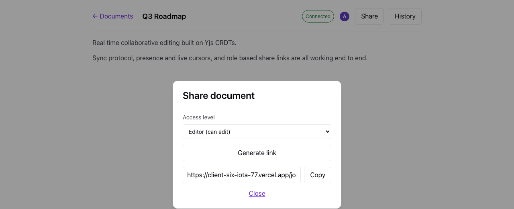

# Real-Time Collaborative Document Editor

[](https://github.com/Shreyash021104/realtime-collab-doc-editor/actions/workflows/ci.yml)
[](LICENSE)
[](https://client-six-iota-77.vercel.app)

A Google Docs-style editor: multiple people open the same document, type at the same
time, see each other's cursors live, and never lose a keystroke — even if two people
edit the exact same spot at the exact same moment.

**Live demo:** https://client-six-iota-77.vercel.app (frontend, Vercel) talking to
https://collab-doc-editor-server.onrender.com (backend, Render). Both on free tiers —
see the caveats in [Deployment](#deployment) before judging cold-start latency.

<p align="center">
  
</p>

<details>
<summary>More screenshots (dashboard, share dialog)</summary>
<br>

| Dashboard | Share dialog |
|---|---|
|  |  |

</details>

## The problem

Naive "collaborative" editors either lock the document for one editor at a time, or
resolve conflicts with last-write-wins, which silently destroys the loser's edits.
Building this correctly requires a data structure where concurrent edits are
mathematically guaranteed to converge to the same result on every client, regardless
of the order operations arrive in. That's a CRDT (Conflict-free Replicated Data Type),
and the interesting engineering isn't "can I call a CRDT library" — it's the sync
protocol, persistence strategy, and access-control model built around it.

## Architecture

```
 Browser A                      Browser B
 (Tiptap + Yjs doc)             (Tiptap + Yjs doc)
      │                               │
      │  WebSocket (binary,           │
      │  Yjs sync + awareness         │
      │  protocol)                    │
      ▼                               ▼
            ┌─────────────────────────────┐
            │   Node.js WS + REST server   │
            │                               │
            │  Room registry (per-doc):     │
            │   - in-memory Y.Doc           │
            │   - Awareness (cursors)       │
            │   - connection set            │
            └──────────────┬────────────────┘
                            │
        ┌───────────────────┼───────────────────┐
        ▼                   ▼                   ▼
   PostgreSQL           Redis                Broadcast to
   (doc state,      (ephemeral presence:      every other
   permissions,      who's online per doc,     connection in
   share links,      TTL'd heartbeat keys)     the room except
   version snapshots)                          the sender
```

**Request flow for a keystroke:** browser applies the edit to its local Yjs doc
instantly (offline-first, zero-latency typing) → Yjs emits a binary update → sent
over the WebSocket → server applies it to the room's in-memory `Y.Doc` → server
re-broadcasts the same update to every other connection in that room → server
debounces a write of the full document state to Postgres.

## Tech stack

| Layer | Choice |
|---|---|
| Editor | React + TypeScript, Tiptap (ProseMirror), Yjs (CRDT) |
| Real-time transport | Raw WebSockets (`ws`), hand-rolled Yjs sync/awareness protocol handling |
| Backend | Node.js + Express |
| Persistence | PostgreSQL (documents, permissions, share links, version snapshots) |
| Ephemeral state | Redis (presence heartbeats) |
| Auth | JWT, bcrypt password hashes |
| Deployment | Frontend → Vercel. Backend (needs persistent WS connections, not serverless) → Render |

## The four hardest decisions

### 1. The server never sees "keystrokes" — it relays opaque CRDT updates

The server has zero awareness of *what* changed in a document. It receives a binary
Yjs update, applies it to an in-memory `Y.Doc`, and rebroadcasts the identical bytes.
This is what makes the conflict resolution "free" — Yjs guarantees that applying the
same set of updates in any order converges to the same document, so the server never
has to reason about operational transforms, locking, or ordering. The trade-off: the
server can't validate *content* (e.g. "block profanity") without decoding the CRDT,
which most naive implementations skip and I did too — documented as a real limitation
below.

### 2. A connection-setup race that silently dropped every first sync

The original implementation authenticated the WebSocket connection, loaded the
document's Yjs state from Postgres, and wrote a presence record to Redis — all
`await`ed — *before* attaching the `ws.on("message")` listener. Real Yjs clients
(and my own test client) send their initial `SyncStep1` the instant the socket opens,
which routinely arrived *before* those awaits resolved. Node's EventEmitter doesn't
buffer emitted events for listeners that don't exist yet, so that first message was
silently and permanently lost — the client would sit there synced to nothing.

I caught this with an integration test (`scripts/sync-smoke-test.mjs`) that spins up
two real WebSocket clients and asserts they converge on identical text; the first
version of the test failed with client B ending up with just its own text, never
merging in client A's persisted content. The fix: attach the message listener
*synchronously* on connection, queue anything that arrives during async setup, and
drain the queue once setup completes. This is exactly the kind of "what happens when
two things happen at the same time" bug interviewers ask about — and I have a
reproducible failing test to show for it, not just a war story.

### 3. Read-only sharing has to be enforced twice, at two different layers

A "viewer" share link disables the editor in the React UI (`editable: false`) — but
that's advisory, not security. A viewer's browser still holds a fully-functional Yjs
document and a WebSocket connection; nothing stops a modified client, or a raw script,
from sending write updates directly over the socket. So the *server* independently
checks the connection's role on every incoming sync message and silently drops
`SyncStep2`/`Update` messages from non-editors, while still answering their
`SyncStep1` requests (read access). `scripts/viewer-enforcement-test.mjs` proves this
by bypassing the UI entirely — connecting as a viewer and sending a raw update — and
asserting the server never persists or broadcasts it.

### 4. React StrictMode silently killed the WebSocket provider on every mount

The first version of the client created the Yjs doc and `WebsocketProvider` with
`useMemo` and destroyed them in the corresponding `useEffect` cleanup. That's the
textbook React pattern for "create an expensive object once, clean it up on unmount"
— and it's exactly wrong for Yjs providers under React 18/19 StrictMode, which
intentionally double-invokes effects in dev (mount → cleanup → mount) to surface
side-effect bugs. Because `useMemo`'s cached value survives that double-invoke, the
simulated cleanup called `.destroy()` on the *same* provider object the second effect
run would go on to reuse — closing its WebSocket mid-handshake and leaving the app
stuck showing "connecting" forever, for every single page load in dev.

I only caught this by actually driving the app in a real browser: I wrote a
Playwright script (`scripts/visual-check.mjs`) that registers two users, has one
create a document and share it, has the other join and type concurrently, and asserts
their rendered text converges. It failed — one browser stayed empty, console showing
`WebSocket is closed before the connection is established`. My server-level
integration tests (decisions #2 and #3) never would have caught this, because they
don't go through React at all; this is specifically a React-lifecycle bug, not a
protocol bug.

The fix: move provider/doc creation out of `useMemo` into a module-level cache keyed
by document ID, reference-counted across mounts (`client/src/hooks/useCollabDoc.ts`).
Each `acquire()` either hands back a still-live entry or, if the previous one was just
torn down, builds a genuinely fresh provider — never a half-destroyed one. StrictMode
still causes one harmless throwaway connection attempt per mount (cosmetic console
noise, dev-only), but the app now converges correctly instead of hanging.

## Persistence strategy

Writing to Postgres on every keystroke would mean one write per character. Instead,
each in-memory room debounces: after `SNAPSHOT_INTERVAL_MS` (default 3s) of no new
updates, it flushes `Y.encodeStateAsUpdate(doc)` — the full current state — to
`documents.state`. On top of that, roughly every 2 minutes of active editing it also
writes a labelled row to `document_snapshots`, giving cheap version history without a
write amplification problem. On the *last* connection leaving a room, it flushes
synchronously before freeing the in-memory doc, so nothing is lost between "last
person closes the tab" and "the debounce timer would have fired."

## Access control model

- **owner**: created the doc; can generate/rotate share links, rename, edit.
- **editor**: can edit and see live presence; granted via an editor-role share link.
- **viewer**: read-only; sees the document and other users' cursors but the editor is
  disabled client-side *and* writes are rejected server-side (see decision #3 above).

Share links are single-role, revocable-by-rotation tokens (`document_share_links`),
not permanent — redeeming one only ever *upgrades* a user's access, never downgrades
an existing higher role.

## What I'd change at 10x scale

- **Single point of failure per document.** Each doc's `Y.Doc` lives in exactly one
  server process's memory. Scaling to multiple server instances requires either
  sticky sessions (route a document's connections to the same instance) or a Redis
  pub/sub relay so every instance holding a connection for a doc receives every
  update — the presence layer already uses Redis, so extending it to relay sync/
  awareness messages between instances would follow the same pattern.
- **No content moderation or rate limiting on updates.** A malicious editor could
  spam updates; nothing currently throttles per-connection message rate.
- **Version history is list-only.** Snapshots are captured and listed but not
  restorable from the UI yet — restoring would need to replace the live `Y.Doc`'s
  state without producing a merge conflict with anyone currently editing, which is
  its own small design problem (probably: apply the snapshot as a new update authored
  by the restoring user, rather than truncating history).
- **748 KB JS bundle** (Tiptap + ProseMirror + Yjs), gzipped to ~236 KB. Fine for a
  portfolio demo; at real scale I'd code-split the editor behind a dynamic `import()`
  so the document list page doesn't pay that cost.

## Verifying it yourself

Two server-level integration tests exercise the actual sync protocol against a
running server — not mocks:

```bash
cd server
npm run test:sync                 # two clients, concurrent edits, asserts convergence
npm run test:viewer-enforcement   # viewer bypasses the UI, asserts the server rejects it
```

A third test drives two real Chromium browser sessions through the actual app —
signup, create doc, generate a share link, join, type concurrently in both windows —
and asserts the rendered editor content converges and presence avatars appear:

```bash
cd client
npm run test:visual   # requires both `server` and `client` dev servers already running
```

All three were used during development to catch real bugs (see decisions #2, #3, and
#4 above), not written after the fact.

## Running locally

Requires PostgreSQL and Redis (locally via Homebrew: `brew install postgresql@16
redis && brew services start postgresql@16 && brew services start redis` — or via
`docker compose up -d postgres redis` from the repo root).

```bash
# Backend
cd server
cp .env.example .env
npm install
createdb collab_docs   # or: docker compose up -d postgres redis
npm run migrate
npm run dev            # http://localhost:4000

# Frontend (separate terminal)
cd client
cp .env.example .env
npm install
npm run dev             # http://localhost:5173
```

## Deployment

**What's actually running:** backend on Render (free web service + free Postgres +
free Key Value/Redis, Singapore region), frontend on Vercel. Both deployed from this
repo's `main` branch.

- **Backend (Render)**: a `web_service` with root directory `server`, build command
  `npm ci && npm run build`, start command `npm start`, health check path `/health`.
  `DATABASE_URL` / `REDIS_URL` point at Render's *internal* connection strings for the
  Postgres and Key Value instances (same private network, no public exposure needed).
  Fly.io was the original plan (see the tech stack table above) but it requires a
  credit card on file even for free-tier resources; Render's free web service tier
  doesn't, so that's what's actually live.
- **Frontend (Vercel)**: `VITE_API_URL` / `VITE_WS_URL` point at the Render backend's
  `https://` / `wss://` URLs. Needs a `vercel.json` rewrite (`/(.*) → /index.html`) —
  without it, every client-side route except `/` 404s on refresh or direct link,
  since Vercel's static file server has no idea `/documents/:id` isn't a real file.
  Caught this by actually curling the deployed routes, not just the root path.

**Known trade-offs of the free-tier deployment** (not code limitations, infra ones):
- Render's free Postgres **expires 30 days after creation** and isn't recoverable
  after that — fine for a demo, not for anything you'd want to keep data in long-term.
- Render's free web service **spins down after 15 minutes idle**; the first request
  after that takes ~30-50s to cold-start (the health check path exists partly to make
  that visible rather than silent).
- The Postgres instance's IP allow-list is currently open (`0.0.0.0/0`) to allow
  running migrations from outside Render's network; access still requires the
  database credentials, but on a real production deploy this would be narrowed to
  Render's own egress ranges (or migrations run from *within* the network instead).

**To deploy your own copy:**
1. Provision a Postgres database and a Redis-compatible store (Render, Fly, Railway,
   Neon + Upstash, whatever) and run `server/src/migrations/001_init.sql` against it.
2. Deploy `server/` as a long-lived Node process (not a serverless function — it holds
   persistent WebSocket connections). Set `DATABASE_URL`, `REDIS_URL`, `JWT_SECRET`,
   `CORS_ORIGIN` from `server/.env.example`.
3. Deploy `client/` to Vercel (or any static host with SPA rewrite support). Set
   `VITE_API_URL` / `VITE_WS_URL` to the backend's `https://` / `wss://` URLs, and
   make sure the host rewrites unknown paths to `index.html`.

## Contributing

This is a personal portfolio project, and `main` is protected: changes land through
pull requests, reviewed and merged by [@Shreyash021104](https://github.com/Shreyash021104)
— nothing pushes to `main` directly, including from AI tooling. If you'd like to
contribute:

1. Fork the repo and branch off `main`.
2. Open a PR describing what changed and why. CI (typecheck, build, and the
   integration/browser tests described in [Verifying it yourself](#verifying-it-yourself))
   must pass before it's reviewable.
3. Expect review comments — this repo is used as a portfolio/interview reference, so
   changes need to hold up to the same "why did you do it this way" scrutiny described
   throughout this README.

See [CONTRIBUTING.md](CONTRIBUTING.md) for more detail.

## License

[MIT](LICENSE)
